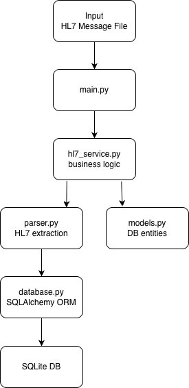
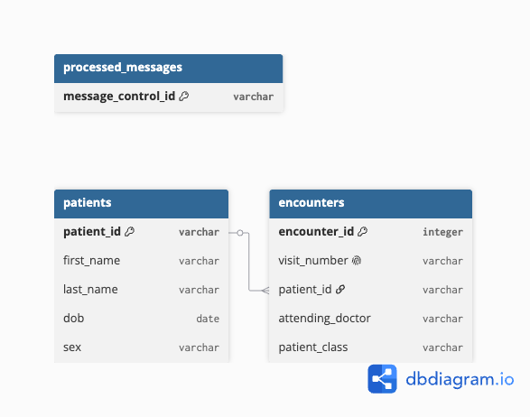

# HL7 v2 Parser Project
Developed a healthcare interoperability backend system in Python that parses HL7 v2 ADT messages, performs patient and encounter reconciliation, and persists structured clinical data into a relational database using SQLAlchemy and SQLite. Implemented idempotent message processing and layered service architecture following healthcare integration patterns.

## Architecture

 1. Datei öffnen und gesamten Inhalt lesen
 2. \r durch \n ersetzen und dann am Zeilenumbruch splitten:
    HL7-Dateien trennen Segmente oft mit \r, manchmal auch mit \n
 3. Jedes Segment mit | splitten
 4. Wenn das Segment mit PID beginnt, werden Felder extrahiert.
...

## Database Schema

## HL7 v2
### Struktur
 - Segmente aus MSH, PID & PV1
 - Felder getrennt durch |
 - Komponenten innerhalb eines Feldes getrennt durch ^

 MSH beinhaltet Header

 PID ist Patienten Segment

 PV1 ist Patient Visit

## Wichtige Einschränkungen
 Der Code ist sehr einfach und hat einige Limitierungen:

 - er ignoriert MSH-Encoding, z. B. wenn Feldtrenner anders sind
 - er geht davon aus, dass das HL7-Format sauber ist
 - er nutzt keine HL7-Bibliothek, sondern nur einfache String-Splits
 
Daher sind HL7-Bibliotheken sinnvoll.
Bspw.: hl7apy, python-hl7 & simple-hl7.

## Skills
### Backend Skills
- Python
- SQLAlchemy
- SQLite
- ORM usage
- layered architecture
### Healthcare Skills
- HL7 v2
- ADT messaging
- encounter reconciliation
- interoperability
### Engineering Skills
- ETL pipelines
- idempotency
- schema design
- business logic separation

## ToDo
### Parser improvements
- safe indexing helper
- safe name parsing
- safe datetime parsing
- return None for missing fields
- never throw on bad HL7
### Tests
- missing name
- partial name
- broken HL7
- missing DOB
- empty message
- tests for other python scripts